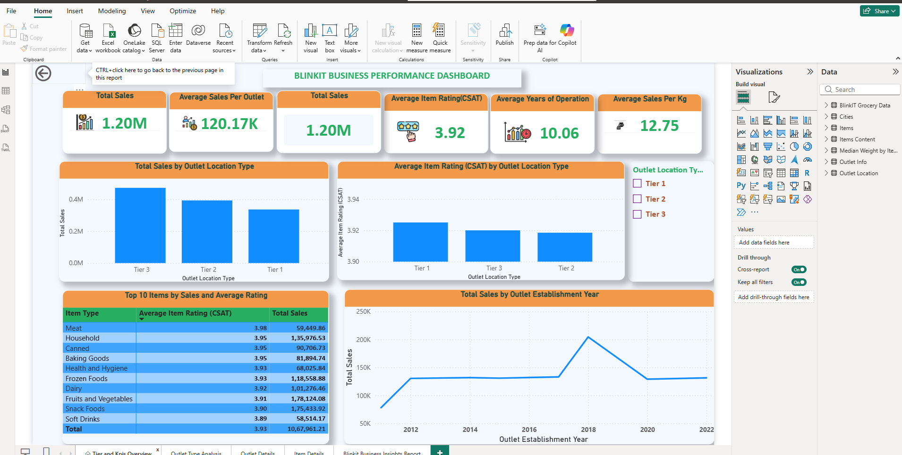
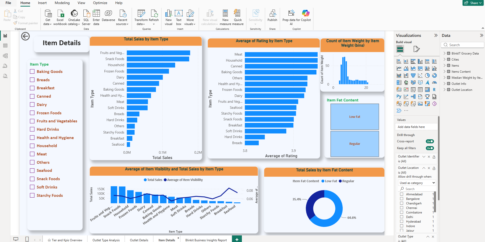
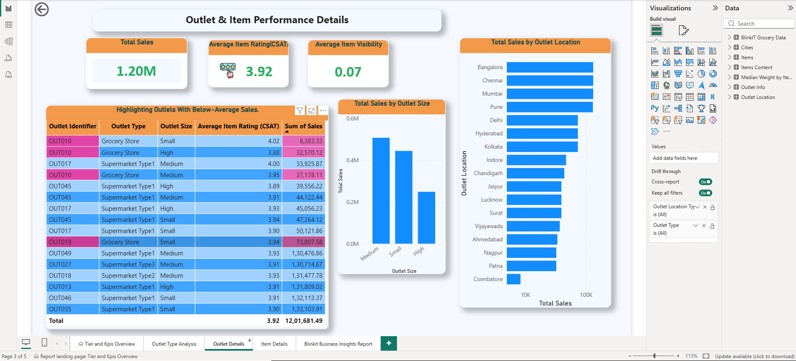
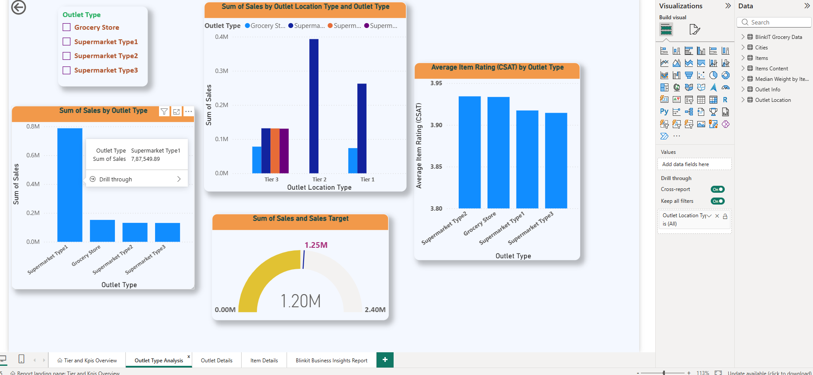

# Blinkit Grocery Sales & Outlet Performance Analysis

## 📊 Project Overview

This project is an interactive **Power BI dashboard** developed to analyze Blinkit's grocery sales, product performance, outlet operations, customer satisfaction, and outlet-level performance.

The objective is to transform raw grocery sales data into meaningful business insights that can help management identify high-performing products, underperforming categories, outlet performance gaps, and opportunities for business improvement.

---

## 🎯 Business Problem

Blinkit management wants to understand:

* Which product categories contribute the most to overall sales?
* How does fat content affect product sales?
* How do outlet types and outlet sizes impact sales performance?
* How does outlet performance vary across Tier 1, Tier 2, and Tier 3 cities?
* Which products have high visibility but relatively low sales?
* Which are the top-performing products based on sales and ratings?
* How does customer satisfaction vary across product categories and outlet types?

---

## 📌 Key KPIs

* **Total Sales:** $1.20M
* **Average Sales per Outlet:** $120.7K
* **Average Item Rating:** 3.97
* **Total Outlets:** 10
* **Total Items:** 8,523


---

## 📈 Dashboard Features

### 1. Sales & Product Analysis

The dashboard analyzes sales contribution across different product categories and identifies the products that generate the highest revenue.

### 2. Outlet Performance Analysis

Outlet performance is analyzed based on:

* Outlet Type
* Outlet Size
* Outlet Location
* City Tier
* Years of Operation

### 3. Product Visibility Analysis

Item visibility is compared with sales performance to identify products that have high visibility but comparatively lower sales.

### 4. Customer Satisfaction Analysis

Average item ratings are used as a customer satisfaction indicator to compare performance across categories and outlet types.

### 5. Interactive Drill-Through

The dashboard provides drill-through analysis from:

**City Tier → Outlet Type → Outlet → Item**

This allows users to move from a high-level business view to detailed outlet and product-level analysis.

---

## 📊 Dashboard Visualizations

The Power BI dashboard includes:

* KPI Cards
* Bar Charts
* Column Charts
* Donut Charts
* Funnel Chart
* Gauge Chart
* Matrix/Table
* Conditional Formatting
* Drill-through Analysis
* Interactive Slicers

---

## 🔍 Key Business Insights

* A small number of product categories contribute a significant share of overall sales.
* Outlet performance varies based on outlet type, size, and location.
* Regular-fat products contribute a substantial portion of total sales compared with low-fat products.
* Some products have relatively high visibility but do not generate proportionate sales, indicating an opportunity for better product positioning and promotion.
* Outlet-level analysis helps identify below-average performing outlets that may require operational attention.
* Customer ratings provide an additional perspective for evaluating product and outlet performance.

---

## 💡 Strategic Recommendations

* Focus inventory and promotional activities on high-performing product categories.
* Investigate products with high visibility but low sales to understand pricing, placement, or customer preference issues.
* Analyze below-average outlets and identify operational factors affecting their performance.
* Optimize product assortment based on customer demand and sales contribution.
* Use customer ratings to identify categories and products that require quality or service improvements.
* Develop differentiated strategies for outlets operating in different city tiers.

---

## 🛠️ Tools & Technologies

* **Power BI**
* **Power Query**
* **DAX**
* **Data Modeling**
* **Data Cleaning & Transformation**
* **Data Visualization**
* **Business Intelligence**

---

## 🗂️ Dataset

The project uses grocery sales and outlet-related data containing information such as:

* Item Identifier
* Item Type
* Item Weight
* Item Fat Content
* Item Visibility
* Sales
* Outlet Identifier
* Outlet Type
* Outlet Size
* Outlet Location Type
* Outlet Establishment Year
* Item Rating

---

## 📷 Dashboard Preview

### Dashboard Overview


### Product Analysis


### Outlet Analysis


### Outlet Type Analysis

---

## 📁 Project Structure

```text
Blinkit-PowerBI-Dashboard/
│
├── README.md
│
├── Dashboard/
│   └── Blinkit-Dashboard.pbix
│
├── Screenshots/
│   ├── Overview.png
│   ├── Product-Analysis.png
│   └── Outlet-Analysis.png
│
└── Documentation/
    └── Blinkit-Project-Report.pdf
```

---

## 👩‍💻 Project Role

**Role:** Data Analyst / Power BI Developer

### Responsibilities

* Performed data cleaning and transformation using Power Query.
* Designed the data model and relationships.
* Created calculated columns and DAX measures.
* Developed interactive Power BI dashboards.
* Analyzed product, outlet, sales, visibility, and customer rating data.
* Identified business insights and developed strategic recommendations.
* Designed drill-through functionality for detailed outlet and product analysis.

---

## 📌 Conclusion

This Power BI project demonstrates how business data can be transformed into an interactive analytical solution. The dashboard enables management to monitor sales performance, evaluate outlet productivity, identify product-level opportunities, and make data-driven business decisions.

---

## 📬 Contact

**Jaanavi Velishoju**

Data Analyst | Power BI | SQL | Python | Data Analytics
